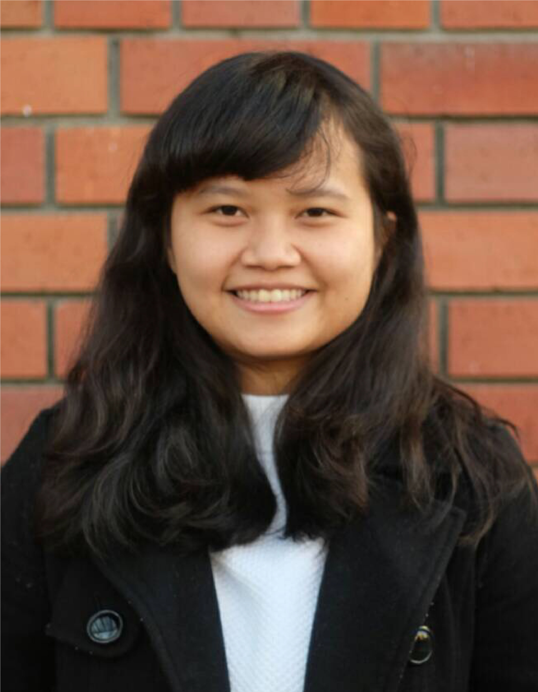

```{r, include=FALSE}
knitr::opts_chunk$set(
  results='asis', 
  echo = FALSE
)

library(tidyverse)
library(glue)

# Set this to true to have links turned into footnotes at the end of the document
PDF_EXPORT <- FALSE

# Holds all the links that were inserted for placement at the end
links <- c()

source('parsing_functions.R')


# First let's get the data, filtering to only the items tagged as
# Resume items
position_data <- read_csv('positions_eracv.csv') 
 # filter(in_resume) 
#%>% 
#  mutate(
    # Build some custom sections by collapsing others
#    section = case_when(
#      section %in% c('research_positions', 'industry_positions') ~ 'positions', 
#      section %in% c('data_science_writings', 'by_me_press') ~ 'writings',
#      TRUE ~ section
#    )
#  ) 


```

Aside
================================================================================


{width=100%}

Contact {#contact}
--------------------------------------------------------------------------------


- <i class="fa fa-envelope"></i> erawijantari@gmail.com
- <i class="fa fa-envelope"></i> erawijantari.p.aa@m.titech.ac.jp
- <i class="fa fa-twitter"></i> [erawijantaript](https://twitter.com/erawijantaript)
- <i class="fa fa-github"></i> [github.com/erawijantari](https://github.com/erawijantari)
- <i class="fa fa-link"></i> [erawijantari.github.io](erawijantari.github.io)
- <i class="fa fa-phone"></i> +81 3-5734-3591


Skills {#skills}
--------------------------------------------------------------------------------
<br>
<i class="fab fa-python"></i> `Python`

<i class="fab fa-r-project"></i> `R`

<i class="fas fa-code-branch"></i> `Git`

<i class="fas fa-terminal"></i> `Bash`

<i class="fab fa-linux"></i> `Unix/Linux`

<i class="fas fa-server"></i> `HPC (SGE)`

<br>
<br>

Experienced in computational bioinformatics and biostatistics applied for next-generation sequencing data integrated to other omics analysis, especially for microbiome study. 

Disclaimer {#disclaimer}
--------------------------------------------------------------------------------
This resume was made with the R package [**pagedown**](https://github.com/rstudio/pagedown).  
<br>

Source code available at: [github.com/erawijantari/cv](https://github.com/erawijantari/academic-kickstart/tree/master/static/files/cv_era). 
<br>

Last updated on `r Sys.Date()`.


Main
================================================================================

Pande Putu Erawijantari {#title}
--------------------------------------------------------------------------------

<font size=2.5> Interested in applying bioinformatics analysis on the complex multi-omics data such as metagenomic, metabolomic, and metatranscriptomic. Current research mainly focus on the dynamics of human gut microbiome in the gastrointestinal-related diseases and its association to treatment effectiveness.  
</font>

Education {data-icon=graduation-cap data-concise=true}
--------------------------------------------------------------------------------

```{r}
position_data %>% print_section('education')
```


Selected Publications {data-icon=book-open}
--------------------------------------------------------------------------------

```{r}
position_data %>% print_section('publication')
```


Selected conferences {data-icon=group}
--------------------------------------------------------------------------------


```{r}
position_data %>% print_section('conference')
```


Teaching Experiences {data-icon=chalkboard-teacher}
--------------------------------------------------------------------------------
::: aside
I am passionate about teaching because I always learn something new from it. Designing the course and effective teaching approach are very challenging process that I mostly enjoyed.
:::

```{r}
position_data %>% print_section('teaching')
```


Selected awards {data-icon=trophy}
--------------------------------------------------------------------------------


```{r}
position_data %>% print_section('award')
```


Work experiences {data-icon=suitcase}
--------------------------------------------------------------------------------
::: aside
### REFERENCE

**TAKUJI YAMADA**\
Associate Professor\
<font size="1">School of Life Science and Technology</font>\
<font size="1">Tokyo Institute of Technology, Tokyo, JP</font>\
<font size="1">+813-5734-3629, takuji@bio.titech.ac.jp</font>
:::

```{r}
position_data %>% print_section('experience')
```
